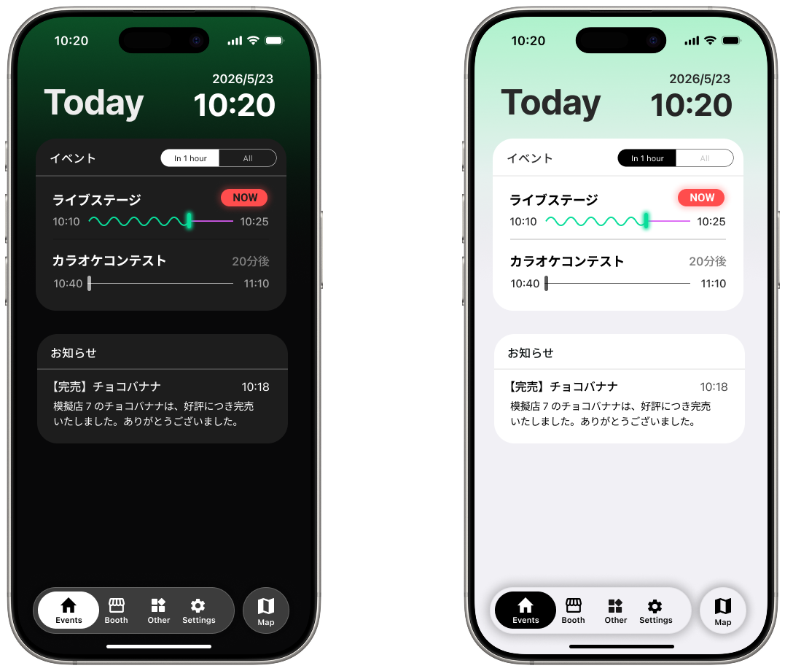

このリポジトリは、第18回高専祭-北斗祭-のウェブアプリのソースコードを管理するためのものです。このウェブアプリでは、北斗祭での模擬店の混雑・在庫状況、イベントタイムテーブル、バスの発着時刻、落とし物情報、Q&Aをリアルタイムに更新し、スムーズにより楽しく回るためのWebアプリケーションです。

**ホームページ :** [https://hokutofes26.github.io/](https://hokutofes26.github.io/)  
**Web App :** [https://hokutofes26.github.io/app](https://hokutofes26.github.io/app)

## 外観

## 特徴

### 1. 操作可能なキャンパスマップ

Leafletを活用したアプリ上のマップで、模擬店、展示、イベントステージの場所を直感的に探すことができます。

### 2. リアルタイムな状況把握

バスの運行状況、落とし物情報、よくある質問（Q&A）など、必要な情報をリアルタイムに確認でき、来場者の利便性向上を両立します。

### 3. 快適なUIとグローバル対応

シンプルで直感的なUI（Ant Design / Material UI icons）を採用し、ダークテーマにも対応。また、日本語と英語の多言語対応（i18n）を行っており、さまざまな来場者も快適に利用できる設計です。

### 4. 運営ページ

Supabase Authによってパスワードログインを通過した運営チーム専用のページにより、同一ウェブアプリ上で情報の配信を行うことができます。

---

## 技術スタック

### フロントエンド

|            |                                         |
| ---------- | --------------------------------------- |
| Framework  | Next.js 15 (App Router)                 |
| Language   | TypeScript                              |
| UI Library | React 19, Ant Design, Material UI Icons |
| Map        | Leaflet, React Leaflet                  |
| i18n       | i18next, react-i18next                  |

### バックエンド / データベース / ログイン

|      |          |
| ---- | -------- |
| BaaS | Supabase |

### その他ライブラリ

|                 |         |
| --------------- | ------- |
| Styling         | Emotion |
| Date Processing | dayjs   |
