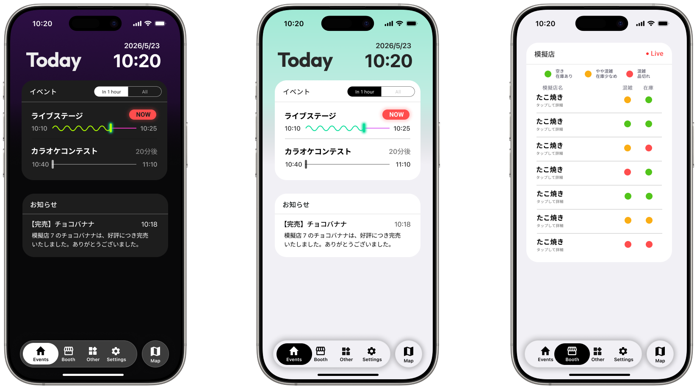

このリポジトリは、第18回高専祭「北斗祭」のウェブアプリのソースコードを管理するためのものです。
本ウェブアプリでは、北斗祭での模擬店の混雑・在庫状況、イベントタイムテーブル、バスの発着時刻、落とし物情報、Q&Aをリアルタイムに更新し、スムーズにより楽しく回るためのWebアプリケーションです。  
特設ホームページについては[このリポジトリ](https://github.com/HokutoFes26/HokutoFes26.github.io)を参照してください。

### アナリティクス
第18回 北斗祭での利用実績は[こちら](https://github.com/HokutoFes26/HokutoFes26.github.io/blob/main/Log_Data.md)を参照してください。

### システムフレームワーク

本アプリは、文化祭向けリアルタイム情報基盤 **[FesTime](https://github.com/rsu-Suba/FesTime)** をベースに構築されています。
本リポジトリは FesTime のリファレンス実装（北斗祭での実運用例）として公開しています。導入を検討される方は、[FesTime プロジェクト本体](https://github.com/rsu-Suba/FesTime) を参照してください。

このアプリの提供機能や技術的な詳細については、[FesTime フレームワークドキュメント](https://festime.suba.pro/guide/getting-started/) を参照してください。

## 公開URL

- ウェブアプリ : [https://hokutofes26.github.io/app](https://hokutofes26.github.io/app)
- デモページ : [https://hokutofes26.github.io/app/demo](https://hokutofes26.github.io/app/demo)

## 外観

